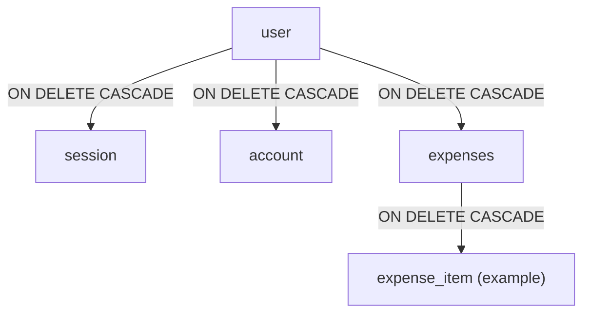

# Database Schema Conventions

## Scope

This document defines the target-state standard for database schema authoring in this project.
All new tables, relations, and DB utilities must follow these conventions.

## Version Guardrail

- The project must use **Drizzle ORM v1** table and relations conventions.
- All relations must use Drizzle v1 `relations(...)` with `one` and `many`.
- Contributors must not introduce deprecated or non-v1 relation-definition patterns in this codebase.

## Schema Layout

- Each table must live in its own file under `src/db/schema/` using the `*.schema.ts` suffix.
- `src/db/schema/index.ts` must be the single barrel export for all table and relation modules.
- `src/db/schema/relations.ts` must define relation objects for all relational tables.
- `drizzle.config.ts` and `src/db/index.ts` must keep using `src/db/schema/index.ts` as the schema entry point.

## Table Authoring Rules

- Every table must be defined with `sqliteTable(...)` in its own `*.schema.ts` file.
- User-owned entities should include:
  - shared `id` from `src/db/utils.ts`,
  - shared `...timestamps` from `src/db/utils.ts`,
  - explicit FK columns with `.references(...)` where ownership exists,
  - indexes for lookup-heavy columns (especially FK columns and external-id columns).
- Constraint behavior must be explicit in schema code. Do not rely on implicit DB behavior.

## Shared Utilities (`src/db/utils.ts`)

### Current Shared Utilities

- `id` must be the default primary key helper.
- `timestamps` must be used for `createdAt` and `updatedAt` defaults and update behavior.

### Creating New Utility Helpers

Add a new utility to `src/db/utils.ts` only when all conditions are true:

- It is reused (or expected to be reused) across multiple tables.
- It expresses one stable business convention (for example, money precision, status enum, soft delete columns).
- It can be typed and documented clearly.

When adding a new utility:

1. Create a focused helper name that describes intent (for example, `ownershipColumns`, `moneyAmount`, `softDeleteColumns`).
2. Keep defaults and update behavior inside the helper when shared behavior is required.
3. Keep the helper DB-dialect safe for Turso/libSQL + SQLite.
4. Use the helper in all relevant table files so schema conventions stay consistent.
5. Update this document when a new utility becomes part of the default table standard.

## Foreign Keys and Cascades

### User-Root Ownership Rule

- `user` is the root owner entity.
- Any table that is owned by a user must reference `user.id` with:
  - `.references(() => user.id, { onDelete: "cascade" })`
- Deleting a user must delete all user-owned dependent rows.

Examples:

- `session.userId -> user.id` with `onDelete: "cascade"`.
- `account.userId -> user.id` with `onDelete: "cascade"`.
- `expenses.userId -> user.id` with `onDelete: "cascade"`.

### Weak-Dependent Chain Rule

- If a child entity belongs only to a parent entity (and not directly to user), the child must reference the parent with `onDelete: "cascade"`.
- Deleting the parent must delete the weak dependent rows.

Example pattern:

- `expense_item.expenseId -> expenses.id` with `onDelete: "cascade"`.

### FK and Index Pairing

- Foreign key columns should also have a supporting index unless there is a strong reason not to.
- Index names should be explicit and table-scoped (for example, `session_user_id_idx`, `expense_item_expense_id_idx`).

## Relations (`src/db/schema/relations.ts`)

- Relation definitions must live in `src/db/schema/relations.ts`.
- Use Drizzle v1 `relations(table, ({ one, many }) => ({}))` only.
- Relation exports should follow `<tableName>Relations` naming (for example, `userRelations`, `sessionRelations`).
- Every relation must map to an explicit FK in a table schema file.
- Do not add relation-only links without backing FK columns.

## New Table Checklist

For every new table:

1. Create `src/db/schema/<table>.schema.ts` with `sqliteTable(...)`.
2. Reuse shared utilities (`id`, `timestamps`) unless there is a documented exception.
3. Add FK columns and `onDelete: "cascade"` according to ownership rules.
4. Add required indexes (especially for FK columns).
5. Add/extend relation definitions in `src/db/schema/relations.ts`.
6. Export the table module from `src/db/schema/index.ts`.
7. Generate migration files and review SQL for expected FK + cascade behavior.
8. Validate with project checks before merge.

## Delete Semantics

